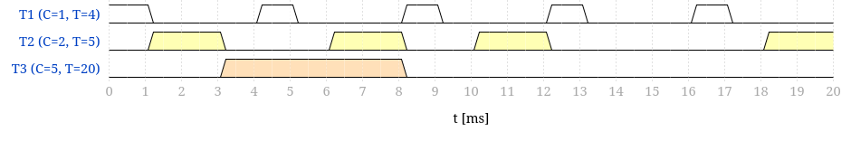
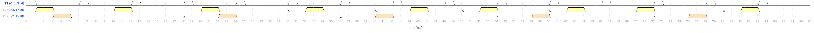
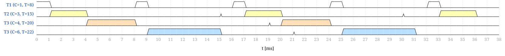
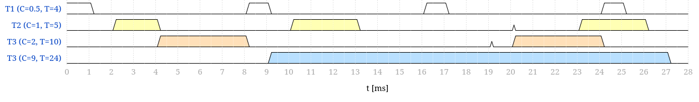

# Paso 02 - Cyclic scheduling

## Sistema 1

| Tarea | C   | T = D |
| :---- | :-- | :---: |
| T1    | 1   |   4   |
| T2    | 2   |   5   |
| T3    | 5   |  20   |

### Factor de uso

$$U = \frac{1}{4} + \frac{2}{5} + \frac{5}{20} = 0.9 \leq 1$$

### Hiperperiodo

$$H = T_m = \text{mcm}(4,5,20) = 20$$

### Periodo secundario

$$T_s = \text{mcd}(4,5,20) = 1 \rightarrow \text{elijo } 5 \text{ que es divisor del } T_m$$

### Test de garantía

1. $T_s = 5 \geq \max(C_i) = 5 \Rightarrow$ **CUMPLE**
2. $U = 0.9 \leq 1 \Rightarrow$ **CUMPLE**
3. $T_m = \text{mcm}(4,5,20) = 20 \Rightarrow$ **CUMPLE**
4. $2T_s - \text{mcd}(T_s, T_i) \leq T_i$:

   | Tarea | Cálculo                                    |   Resultado   |
   | :---- | :----------------------------------------- | :-----------: |
   | T1    | $2 \cdot 5 - \text{mcd}(5,4) = 9 \leq 4$   | **NO CUMPLE** |
   | T2    | $2 \cdot 5 - \text{mcd}(5,5) = 5 \leq 5$   |    CUMPLE     |
   | T3    | $2 \cdot 5 - \text{mcd}(5,20) = 5 \leq 20$ |    CUMPLE     |

**No cumple por condición 4.**

Se puede ver el porque no cumple simplemente con un grafico aproximado de Gantt:

Se observa como la tarea 3 no tiene ningun espacio de 5 donde pueda entrar correctamente. Se podria hacer si la tarea 3 se separa en segmentos mas pequeños.

## Sistema 2

| Tarea | C   | T = D |
| :---- | :-- | :---: |
| T1    | 1   |   6   |
| T2    | 2   |  10   |
| T3    | 2   |  18   |

### Factor de uso

$$U = \frac{1}{6} + \frac{2}{10} + \frac{2}{18} = 0.478 \leq 1$$

### Hiperperiodo

$$H = T_m = \text{mcm}(6, 10, 18) = 90$$

### Periodo secundario

$$T_s = \text{mcd}(6, 10, 18) = 2$$

### Test de garantía

1. $T_s = 2 \geq \max(C_i) = 2 \Rightarrow$ **CUMPLE**
2. $U = 0.478 \leq 1 \Rightarrow$ **CUMPLE**
3. $T_m = \text{mcm}(6, 10, 18) = 90 \Rightarrow$ **CUMPLE**
4. $2T_s - \text{mcd}(T_s, T_i) \leq T_i$:

   | Tarea | Cálculo                                    | Resultado |
   | :---- | :----------------------------------------- | :-------: |
   | T1    | $2 \cdot 2 - \text{mcd}(2,6) = 2 \leq 6$   |  CUMPLE   |
   | T2    | $2 \cdot 2 - \text{mcd}(2,10) = 2 \leq 10$ |  CUMPLE   |
   | T3    | $2 \cdot 2 - \text{mcd}(2,18) = 2 \leq 18$ |  CUMPLE   |

**Este sistema sí cumple el test de garantía.**

La siguiente imagen tiene el Gantt de el hiperciclo completo donde no se superpone ninguna tarea:

Como se puede ver, los "picos" representan cuando se termina el periodo de cada tarea. Sino esta presente el pico es porque el siguiente bloque de ejecucion representa el comienzo del nuevo ciclo.

## Sistema 3

| Tarea | C   | T = D |
| :---- | :-- | :---: |
| T1    | 1   |   8   |
| T2    | 3   |  15   |
| T3    | 4   |  20   |
| T4    | 6   |  22   |

### Factor de uso

$$U = \frac{1}{8} + \frac{3}{15} + \frac{4}{20} + \frac{6}{22} = 0.797 \leq 1$$

### Hiperperiodo

$$H = T_m = \text{mcm}(8, 15, 20, 22) = 1320$$

### Periodo secundario

$$T_s = \text{mcd}(8, 15, 20, 22) = 1 \rightarrow \text{elijo } 8$$

Se eligio 8 porque logra cumplir la condición 4, no así como ocurre con el 6 que cumple la 1 pero no la 4.
### Test de garantía

1. $T_s = 8 \geq \max(C_i) = 6 \Rightarrow$ **CUMPLE**
2. $U = 0.797 \leq 1 \Rightarrow$ **CUMPLE**
3. $T_m = \text{mcm}(8, 15, 20, 22) = 1320 \Rightarrow$ **CUMPLE**
4. $2T_s - \text{mcd}(T_s, T_i) \leq T_i$:

   | Tarea | Cálculo                                     | Resultado |
   | :---- | :------------------------------------------ | :-------: |
   | T1    | $2 \cdot 8 - \text{mcd}(8,8) = 8 \leq 8$    |  CUMPLE   |
   | T2    | $2 \cdot 8 - \text{mcd}(8,15) = 15 \leq 15$ |  CUMPLE   |
   | T3    | $2 \cdot 8 - \text{mcd}(8,20) = 12 \leq 20$ |  CUMPLE   |
   | T4    | $2 \cdot 8 - \text{mcd}(8,22) = 14 \leq 22$ |  CUMPLE   |

Este sistema si cumple el test de garantia.

Debido a la longitud del hiperperiodo se incluyo solo un segmento del diagrama de Gantt:

## Sistema 4

| Tarea |  C  | T = D |
| :---- | :-: | :---: |
| T1    | 0,5 |   4   |
| T2    |  1  |   5   |
| T3    |  2  |  10   |
| T4    |  9  |  24   |

### Factor de uso

$$U = \frac{0{,}5}{4} + \frac{1}{5} + \frac{2}{10} + \frac{9}{24} = 0.9 \leq 1$$

### Hiperperiodo

$$H = T_m = \text{mcm}(4, 5, 10, 24) = 120$$

### Periodo secundario

$$T_s = \text{mcd}(4, 5, 10, 24) = 1 \rightarrow \text{elijo } 9 \text{ para satisfacer condición 1}$$

### Test de garantía

1. $T_s = 9 \geq \max(C_i) = 9 \Rightarrow$ **CUMPLE**
2. $U = 0.9 \leq 1 \Rightarrow$ **CUMPLE**
3. $T_m = \text{mcm}(4, 5, 10, 24) = 120 \Rightarrow$ **CUMPLE**
4. $2T_s - \text{mcd}(T_s, T_i) \leq T_i$:

   | Tarea | Cálculo                                     |   Resultado   |
   | :---- | :------------------------------------------ | :-----------: |
   | T1    | $2 \cdot 9 - \text{mcd}(9,4) = 17 \leq 3$   | **NO CUMPLE** |
   | T2    | $2 \cdot 9 - \text{mcd}(9,5) = 17 \leq 5$   | **NO CUMPLE** |
   | T3    | $2 \cdot 9 - \text{mcd}(9,10) = 17 \leq 10$ | **NO CUMPLE** |
   | T4    | $2 \cdot 9 - \text{mcd}(9,24) = 15 \leq 24$ |    CUMPLE     |

**Este sistema no cumple por la condición 4.**

Al igual que el sistema 3 se incluyo un segmento del hiperperiodo:

En este se observa como la ejecucion de la tarea 4 tambien tiene un periodo largo de ejecucion que no se puede colocar en ningun espacio. Al igual que el sistema 1, se deberia subdividir.

Cabe aclarar que en este caso como la tarea 1 tiene tiempo de ejecución 0.5, cada unidad de tiempo en este grafico representa media milesima de segundo.

# Modificaciones para usar con FreeRTOS

Para poder usar esto con FreeRTOS, se debe deshabilitar `USE_PREEMPTION`, que es un `#define` del `FreeRTOS_config.h`, aunque desde STM32CubeIDE se puede hacer desde el IOC.
