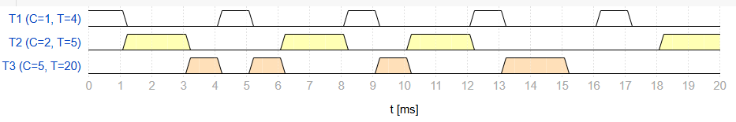
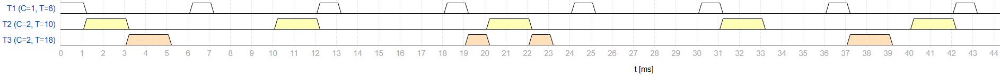
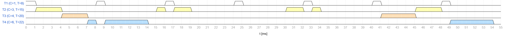
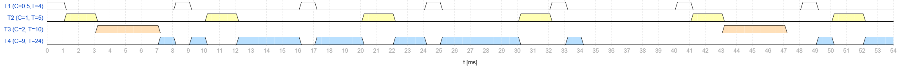

# Paso 02 - Rate Monolitic

Las prioridades se enumeran de mayor a menor siendo el numero mas grande la maxima prioridad.

## Sistema 1

| Tarea | C   | T = D | Prioridades |
| :---- | :-- | :---: | :---------: |
| T1    | 1   |   4   |      3      |
| T2    | 2   |   5   |      2      |
| T3    | 5   |  20   |      1      |

### Factor de uso

$$U = \frac{1}{4} + \frac{2}{5} + \frac{5}{20} = 0{,}9 \leq 3\left(2^{1/3} - 1\right) = 0{,}78 \rightarrow \textbf{No cumple por factor de uso}$$

### Tiempo de respuesta

#### Análisis T1

$$\omega_1 = C_1 = 1$$
$$\omega_1 \le D_1 \ (1 \le 4) \rightarrow \textbf{Planificable}$$

#### Análisis T2

$$\omega_2^0 = 2$$
$$\omega_2^1 = 2 + \lceil 2/4 \rceil \cdot 1 = 2 + 1 \cdot 1 = 3$$
$$\omega_2^2 = 2 + \lceil 3/4 \rceil \cdot 1 = 2 + 1 \cdot 1 = 3$$
$$\omega_2 \le D_2 \ (3 \le 5) \rightarrow \textbf{Planificable}$$

#### Análisis T3

$$\omega_3^0 = 5$$
$$\omega_3^1 = 5 + \lceil 5/4 \rceil \cdot 1 + \lceil 5/5 \rceil \cdot 2 = 5 + 2 \cdot 1 + 1 \cdot 2 = 9$$
$$\omega_3^2 = 5 + \lceil 9/4 \rceil \cdot 1 + \lceil 9/5 \rceil \cdot 2 = 5 + 3 \cdot 1 + 2 \cdot 2 = 12$$
$$\omega_3^3 = 5 + \lceil 12/4 \rceil \cdot 1 + \lceil 12/5 \rceil \cdot 2 = 5 + 3 \cdot 1 + 3 \cdot 2 = 14$$
$$\omega_3^4 = 5 + \lceil 14/4 \rceil \cdot 1 + \lceil 14/5 \rceil \cdot 2 = 5 + 4 \cdot 1 + 3 \cdot 2 = 15$$
$$\omega_3^5 = 5 + \lceil 15/4 \rceil \cdot 1 + \lceil 15/5 \rceil \cdot 2 = 5 + 4 \cdot 1 + 3 \cdot 2 = 15$$
$$\omega_3 \le D_3 \ (15 \le 20) \rightarrow \textbf{Planificable}$$

**Entonces el sistema 1 es planificable**

### Gantt con monotonic

## Sistema 2

| Tarea | C   | T = D | Prioridades |
| :---- | :-- | :---: | :---------: |
| T1    | 1   |   6   |      3      |
| T2    | 2   |  10   |      2      |
| T3    | 2   |  18   |      1      |

### Factor de uso

$$U = \frac{1}{6} + \frac{2}{10} + \frac{2}{18} = 0{,}478 \leq 3\left(2^{1/3} - 1\right) = 0{,}78 \rightarrow \textbf{Cumple por factor de uso}$$

### Tiempo de respuesta

#### Análisis T1

$$\omega_1 = C_1 = 1$$
$$\omega_1 \le D_1 \ (1 \le 6) \rightarrow \textbf{Planificable}$$

#### Análisis T2

$$\omega_2^0 = 2$$
$$\omega_2^1 = 2 + \lceil 2/6 \rceil \cdot 1 = 2 + 1 \cdot 1 = 3$$
$$\omega_2^2 = 2 + \lceil 3/6 \rceil \cdot 1 = 2 + 1 \cdot 1 = 3$$
$$\omega_2 \le D_2 \ (3 \le 10) \rightarrow \textbf{Planificable}$$

#### Análisis T3

$$\omega_3^0 = 2$$
$$\omega_3^1 = 2 + \lceil 2/6 \rceil \cdot 1 + \lceil 2/10 \rceil \cdot 2 = 2 + 1 \cdot 1 + 1 \cdot 2 = 5$$
$$\omega_3^2 = 2 + \lceil 5/6 \rceil \cdot 1 + \lceil 5/10 \rceil \cdot 2 = 2 + 1 \cdot 1 + 1 \cdot 2 = 5$$
$$\omega_3 \le D_3 \ (5 \le 18) \rightarrow \textbf{Planificable}$$

**Entonces el sistema 2 es planificable**

### Gantt con monotonic

## Sistema 3

| Tarea | C   | T = D | Prioridades |
| :---- | :-- | :---: | :---------: |
| T1    | 1   |   8   |      1      |
| T2    | 3   |  15   |      2      |
| T3    | 4   |  20   |      3      |
| T4    | 6   |  22   |      4      |

### Factor de uso

$$U = \frac{1}{8} + \frac{3}{15} + \frac{4}{20} + \frac{6}{22} = 0{,}797 \leq 4\left(2^{1/4} - 1\right) = 0{,}757 \rightarrow \textbf{No cumple por factor de uso}$$

### Tiempo de respuesta

#### Análisis T1

$$\omega_1 = C_1 = 1$$
$$\omega_1 \le D_1 \ (1 \le 8) \rightarrow \textbf{Planificable}$$

#### Análisis T2

$$\omega_2^0 = 3$$
$$\omega_2^1 = 3 + \lceil 3/8 \rceil \cdot 1 = 3 + 1 \cdot 1 = 4$$
$$\omega_2^2 = 3 + \lceil 4/8 \rceil \cdot 1 = 3 + 1 \cdot 1 = 4$$
$$\omega_2 \le D_2 \ (4 \le 15) \rightarrow \textbf{Planificable}$$

#### Análisis T3

$$\omega_3^0 = 4$$
$$\omega_3^1 = 4 + \lceil 4/8 \rceil \cdot 1 + \lceil 4/15 \rceil \cdot 3 = 4 + 1 \cdot 1 + 1 \cdot 3 = 8$$
$$\omega_3^2 = 4 + \lceil 8/8 \rceil \cdot 1 + \lceil 8/15 \rceil \cdot 3 = 4 + 1 \cdot 1 + 1 \cdot 3 = 8$$
$$\omega_3 \le D_3 \ (8 \le 20) \rightarrow \textbf{Planificable}$$

#### Análisis T4

$$\omega_4^0 = 6$$
$$\omega_4^1 = 6 + \lceil 6/8 \rceil \cdot 1 + \lceil 6/15 \rceil \cdot 3 + \lceil 6/20 \rceil \cdot 4 = 6 + 1 \cdot 1 + 1 \cdot 3 + 1 \cdot 4 = 14$$
$$\omega_4^2 = 6 + \lceil 14/8 \rceil \cdot 1 + \lceil 14/15 \rceil \cdot 3 + \lceil 14/20 \rceil \cdot 4 = 6 + 2 \cdot 1 + 1 \cdot 3 + 1 \cdot 4 = 15$$
$$\omega_4^3 = 6 + \lceil 15/8 \rceil \cdot 1 + \lceil 15/15 \rceil \cdot 3 + \lceil 15/20 \rceil \cdot 4 = 6 + 2 \cdot 1 + 1 \cdot 3 + 1 \cdot 4 = 15$$
$$\omega_4 \le D_4 \ (15 \le 22) \rightarrow \textbf{Planificable}$$

**Entonces el sistema 3 es planificable**

### Gantt con monotonic

## Sistema 4

| Tarea |  C  | T = D | Prioridades |
| :---- | :-: | :---: | :---------: |
| T1    | 0,5 |   4   |      1      |
| T2    |  1  |   5   |      2      |
| T3    |  2  |  10   |      3      |
| T4    |  9  |  24   |      4      |

### Factor de uso

$$U = \frac{0{,}5}{4} + \frac{1}{5} + \frac{2}{10} + \frac{9}{24} = 0{,}9 \leq 4\left(2^{1/4} - 1\right) = 0{,}757 \rightarrow \textbf{No cumple por factor de uso}$$

### Tiempo de respuesta

#### Análisis T1

$$\omega_1 = C_1 = 0.5$$
$$\omega_1 \le D_1 \ (0.5 \le 4) \rightarrow \textbf{Planificable}$$

#### Análisis T2

$$\omega_2^0 = 1$$
$$\omega_2^1 = 1 + \lceil 1/4 \rceil \cdot 0.5 = 1 + 1 \cdot 0.5 = 1.5$$
$$\omega_2^2 = 1 + \lceil 1.5/4 \rceil \cdot 0.5 = 1 + 1 \cdot 0.5 = 1.5$$
$$\omega_2 \le D_2 \ (1.5 \le 5) \rightarrow \textbf{Planificable}$$

#### Análisis T3

$$\omega_3^0 = 2$$
$$\omega_3^1 = 2 + \lceil 2/4 \rceil \cdot 0.5 + \lceil 2/5 \rceil \cdot 1 = 2 + 1 \cdot 0.5 + 1 \cdot 1 = 3.5$$
$$\omega_3^2 = 2 + \lceil 3.5/4 \rceil \cdot 0.5 + \lceil 3.5/5 \rceil \cdot 1 = 2 + 1 \cdot 0.5 + 1 \cdot 1 = 3.5$$
$$\omega_3 \le D_3 \ (3.5 \le 10) \rightarrow \textbf{Planificable}$$

#### Análisis T4

$$\omega_4^0 = 9$$
$$\omega_4^1 = 9 + \lceil 9/4 \rceil \cdot 0.5 + \lceil 9/5 \rceil \cdot 1 + \lceil 9/10 \rceil \cdot 2 = 9 + 3 \cdot 0.5 + 2 \cdot 1 + 1 \cdot 2 = 14.5$$
$$\omega_4^2 = 9 + \lceil 14.5/4 \rceil \cdot 0.5 + \lceil 14.5/5 \rceil \cdot 1 + \lceil 14.5/10 \rceil \cdot 2 = 9 + 4 \cdot 0.5 + 3 \cdot 1 + 2 \cdot 2 = 18$$
$$\omega_4^3 = 9 + \lceil 18/4 \rceil \cdot 0.5 + \lceil 18/5 \rceil \cdot 1 + \lceil 18/10 \rceil \cdot 2 = 9 + 5 \cdot 0.5 + 4 \cdot 1 + 2 \cdot 2 = 19.5$$
$$\omega_4^4 = 9 + \lceil 19.5/4 \rceil \cdot 0.5 + \lceil 19.5/5 \rceil \cdot 1 + \lceil 19.5/10 \rceil \cdot 2 = 9 + 5 \cdot 0.5 + 4 \cdot 1 + 2 \cdot 2 = 19.5$$
$$\omega_4 \le D_4 \ (19.5 \le 24) \rightarrow \textbf{Planificable}$$

**Entonces el sistema 4 es planificable**

### Gantt con monotonic

## Uso con FreeRTOS

Para configurar `FreeRTOS`, se puede modificar `FreeRTOSConfig.h` con las siguientes modificaciones:

- Al igual que antes habilitar `configUSE_PREEMPTION`.
- Deshabilitar el slicing con tareas de la misma prioridad con `configUSE_TIME_SLICING` en 0.

Además se podria modificar la maxima cantidad de prioridades, aunque no es estrictamente necesario.
